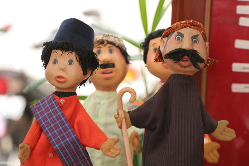

Si Unyil adalah film seri televisi Indonesia produksi PPFN yang mengudara setiap hari Minggu pagi di stasiun TVRI dimulai pada tanggal 5 April 1981 sampai 1993, Minggu pagi di stasiun RCTI dimulai pada tanggal 21 April 2002 hingga awal 2003 dan berpindah ke TPI pada medio 2003 hingga akhir 2003 setiap Minggu pukul 16.30 WIB sebelum program berita Lintas 5. Si Unyil ini diciptakan oleh Drs. Suyadi.

